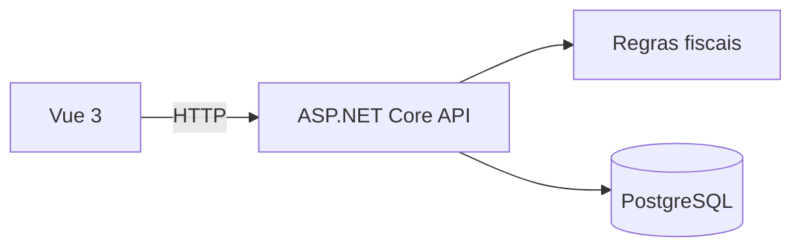

# FiscalFlow

> Plataforma de automação fiscal em desenvolvimento, com validação humana e rastreabilidade das decisões.

O **FiscalFlow** nasceu para reduzir tarefas manuais na conferência de documentos fiscais. A proposta é centralizar a leitura de notas eletrônicas, apoiar a classificação das operações e produzir registros auditáveis, mantendo a decisão final com o profissional responsável.

## Status atual

O projeto está na fase inicial de estruturação da API, do banco de dados e da interface. As funcionalidades fiscais abaixo representam o **escopo planejado** e serão implementadas de forma incremental.

## Escopo planejado

- Importação e leitura de XML de NF-e
- Extração de emitente, destinatário, produtos, NCM, CFOP, CST e valores tributários
- Sugestões de classificação fiscal acompanhadas de justificativa
- Cálculo e conferência de tributos
- Histórico de alterações e validações humanas
- Geração de registros auditáveis

> As sugestões do sistema não substituem a análise de um profissional fiscal ou contábil.

## Arquitetura

| Camada | Tecnologias |
|---|---|
| Frontend | Vue 3, TypeScript |
| Backend | C#, .NET 10, ASP.NET Core, ABP Framework |
| Persistência | Entity Framework Core, PostgreSQL |
| Infraestrutura | Docker |

## Próximas entregas

- [ ] Organizar a estrutura do repositório e arquivos ignorados
- [ ] Modelar documentos fiscais e itens da nota
- [ ] Implementar importação de XML de NF-e
- [ ] Criar endpoints de consulta e validação
- [ ] Desenvolver a primeira tela funcional
- [ ] Adicionar testes automatizados e integração contínua

---

Desenvolvido por [Gabriel Gutierrez](https://github.com/gabrielogutierrez).
