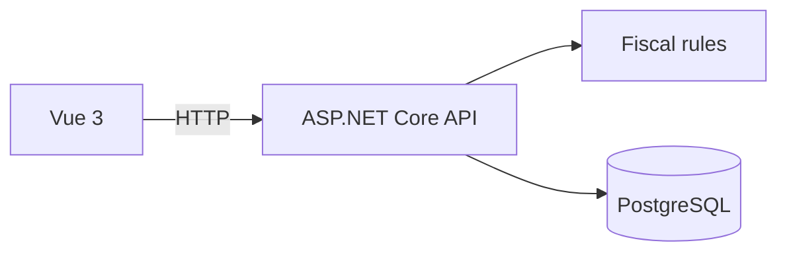

# FiscalFlow

> Intelligent fiscal automation platform under development, built around human validation and auditable decisions.

[English](#english) · [Português](#português)

## English

**FiscalFlow** was created to reduce repetitive work in electronic invoice review. Its goal is to centralize fiscal document processing, support operation classification and generate auditable records while keeping the final decision with a qualified professional.

### Current status

The project is currently in the initial API, database and user interface structuring phase. The features below represent the **planned scope** and will be implemented incrementally.

### Planned scope

- Import and parse Brazilian NF-e XML files
- Extract issuer, recipient, products, NCM, CFOP, CST and tax values
- Suggest fiscal classifications with clear reasoning
- Calculate and validate taxes
- Track changes and human approvals
- Generate auditable fiscal records

> FiscalFlow is a decision-support tool. Its suggestions do not replace professional tax or accounting review.

### Architecture

| Layer | Technologies |
|---|---|
| Frontend | Vue 3, TypeScript |
| Backend | C#, .NET 10, ASP.NET Core, ABP Framework |
| Persistence | Entity Framework Core, PostgreSQL |
| Infrastructure | Docker |

### Roadmap

- [ ] Clean up the repository structure and generated files
- [ ] Model fiscal documents and invoice items
- [ ] Implement NF-e XML import
- [ ] Create query and validation endpoints
- [ ] Build the first functional user interface
- [ ] Add automated tests and continuous integration

---

## Português

O **FiscalFlow** nasceu para reduzir tarefas repetitivas na conferência de notas fiscais eletrônicas. A proposta é centralizar o processamento de documentos fiscais, apoiar a classificação das operações e gerar registros auditáveis, mantendo a decisão final com um profissional qualificado.

### Status atual

O projeto está na fase inicial de estruturação da API, do banco de dados e da interface. As funcionalidades abaixo representam o **escopo planejado** e serão implementadas de forma incremental.

### Escopo planejado

- Importação e leitura de arquivos XML de NF-e
- Extração de emitente, destinatário, produtos, NCM, CFOP, CST e valores tributários
- Sugestões de classificação fiscal acompanhadas de justificativa
- Cálculo e conferência de tributos
- Histórico de alterações e validações humanas
- Geração de registros fiscais auditáveis

> O FiscalFlow é uma ferramenta de apoio à decisão. Suas sugestões não substituem a análise de um profissional fiscal ou contábil.

### Arquitetura

| Camada | Tecnologias |
|---|---|
| Frontend | Vue 3, TypeScript |
| Backend | C#, .NET 10, ASP.NET Core, ABP Framework |
| Persistência | Entity Framework Core, PostgreSQL |
| Infraestrutura | Docker |

### Próximas entregas

- [ ] Organizar a estrutura do repositório e os arquivos gerados
- [ ] Modelar documentos fiscais e itens da nota
- [ ] Implementar a importação de XML de NF-e
- [ ] Criar endpoints de consulta e validação
- [ ] Desenvolver a primeira interface funcional
- [ ] Adicionar testes automatizados e integração contínua

---

Developed by [Gabriel Gutierrez](https://github.com/gabrielogutierrez).
